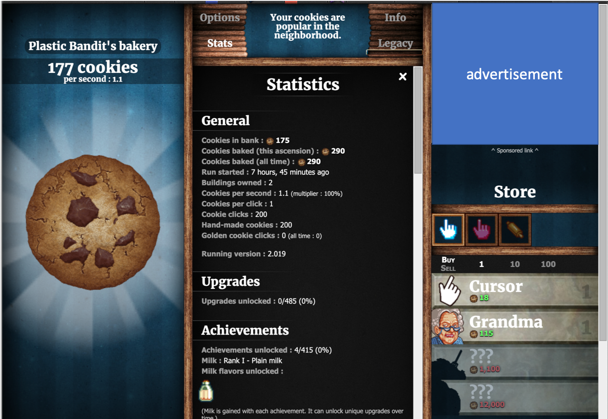
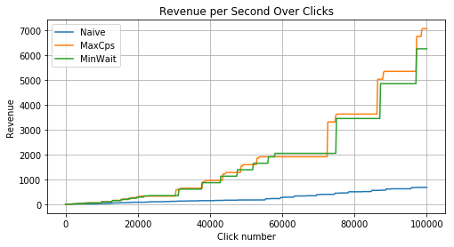
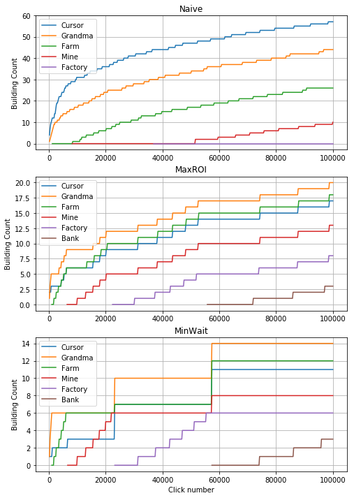
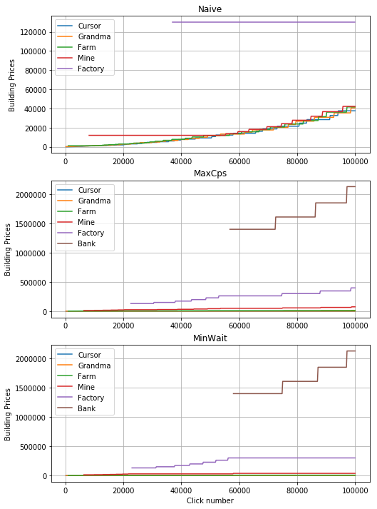
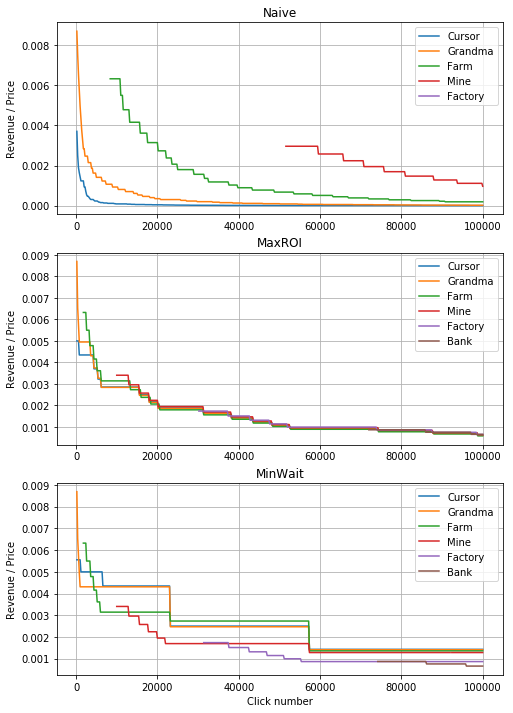

```{r,include=FALSE}
library(reticulate)
```

```{r,include=FALSE}
knitr::opts_chunk$set(comment = ">>>")
#py_discover_config() # to see versions of Python
use_python("/anaconda3/bin/python")
# py_config() # check paths
# test imports
#import("numpy",as="np")
#import("requests")

# path to interpreter from python (I ran in a juperter nb to find the path used here)
# import sys
# print(sys.executable)

# for figures, without issues..;
# https://blogdown-demo.rbind.io/2017/10/06/adding-figures-and-other-images-to-posts/
```

# Overview

Lately I've been interested in writing algorithms that interact with websites. The game [Cookie Clicker](https://orteil.dashnet.org/cookieclicker/) is a great testing ground for such algorithms. The game is played by clicking a big cooke to earn cookies (money) that can be used to buy buildings, which in turn generate more cookies. Here I'll walk through three algorithms that I made to play this game, and assess their performance in the game. The code that implements these algorithms and reproduces all figures in this blog post can be found on my GitHub, here: [https://github.com/MacStrelioff/CookieClickerAgent](https://github.com/MacStrelioff/CookieClickerAgent)

# Background and Setup 

## Cookie Clicker Game

The interface for this game is shown below. 

<!--- UPDATE IMAGE POINTER TO ONE THAT IS CORRECT IN THE FILE STRUCTURE OF THE HOSTED FILES --->



The goal of the game is to amass cookies. A user can earn cookies (currency) by clicking the large cookie. Buildings, shown at the bottom right, are unlocked as one acquires wealth. Purchasing a building provides recurring revenue (cookies per second). For any specific building, the price of the building increases each time the building is purchased. I focused on two metrics when developing the algorithms described below: revenue (cookies per second), and price or cost of a building. 

The game has other mechanics (upgrades, ascension, golden cookies, ...). I also programed functions to purchase upgrades and click golden cookies for temporary buffs, but these functions were disabled here to allow for a more controlled comparison of the algorithms, which only differed in their strategy for purchasing buildings. 

# Helper Functions

This section can be skipped if you are only interested in the different strategies and their performance, which are covered completely in the next two sections. This section explains the code used for numerous helper functions that extracted information from the game interface. 

# Strategies

While the goal is to earn as many cookies as possible, the game also allows revenue to accrue player is away, and the amount of cookies earned by a click can scale with the revenue. For these reasons, I focused on maximizing revenue as the overall goal for any strategy.

## Naive: Buy all affordible investments

The simplest strategy was to purchase any affordible building. 

```{python, eval=FALSE}
def buy_products(self):
    products = driver.find_elements_by_xpath('//div[@class="product unlocked enabled"]')
    while products: # if there are affordible products, buy them
        products[-1].click()
        products = driver.find_elements_by_xpath('//div[@class="product unlocked enabled"]')
```


The code above defines the investment strategy for this agent. First, `driver.find_elements_by_xpath('//div[@class="product unlocked enabled"]')` is used to get a list of the affordible products. The while loop below then clicks (buys) all affordible products, starting with the most expensive. 

## MaxCPS: Buy best revenue to price ratio

The second, more advanced strategy would be to buy the option that had the best revenue to price ratio. 

One challenge was that the revenue is unknown for buildings that have not been purchased yet. I addressed this by imputing a CPS of infinity, which would incentivize buying at least one of these buildings once they become unlocked. 

```{python, eval=FALSE}
class agent_class_max_rps_price_ratio(agent_class_naive):
    # overwrite the buy_products method
    def buy_products(self):
        ## update building info
        self.get_building_info()
        # while best is affordible, buy the best rps/price building
        best_building_affordible = True
        while best_building_affordible:
            ## get unlocked products
            products = (driver.find_elements_by_xpath('//div[@class="product unlocked enabled"]') + 
                        driver.find_elements_by_xpath('//div[@class="product unlocked disabled"]'))
            # find max rps/price building
            max_rps_pp,building_to_buy,product_to_buy = 0,[],[]
            for i,building in enumerate(self.building_info):
                # get rps/price for building
                cur_rps_pp = self.building_info[building]['cps/price'] 
                # if it's the best so far, update max and building id
                if cur_rps_pp > max_rps_pp:
                    max_rps_pp,building_to_buy = cur_rps_pp,building
                    product_to_buy = products[i] # store element to click
            # update balance
            self.log_balance_and_revenue()
            # check if best building is affordible.
            if self.building_info[building_to_buy]['price']<=self.balance:
                # buy building_to_buy (click on this product)
                product_to_buy.click()
                # update building info (including rps per price rps_pp)
                self.get_building_info()
            else: best_building_affordible=False # if not affordible, break the loop  

```


## MinWait: Buy what reduces wait until the highest revenue purchase

This final strategy is a bit more complex. 

- rationale: differences in revenue per building are quite large, so ... .
- pics from ipad of concept figure
- proof that balance doesn't matter 
- sketches of preference as rps and cost of another building change. 


The code to implement this, which makes ample use of helper functions, is provided below. 

```{python, eval=FALSE}
# Max RPS/price agent
class agent_class_min_wait(agent_class_naive):
    # overwrite the buy_products method for this agent's purchase logic
    def buy_products(self):
        ## update building info
        self.get_building_info()
        # while best building affordible, buy it and look for next best building
        best_building_affordible = True
        while best_building_affordible:
            ## get unlocked products
            products = (driver.find_elements_by_xpath('//div[@class="product unlocked enabled"]') + 
                        driver.find_elements_by_xpath('//div[@class="product unlocked disabled"]'))
            # find building with max revenue per second and it's cost
            max_rps,cost_max_rps = 0, float('inf')
            building_to_buy,product_to_buy = [], []
            for i,building in enumerate(self.building_info):
                # get rps for building
                cur_rps = self.building_info[building]['cps'] 
                # if it's the best rps far, update max, cost, and building id
                if cur_rps > max_rps:
                    max_rps,building_to_buy = cur_rps,building
                    cost_max_rps = self.building_info[building]['price'] 
                    product_to_buy = products[i] # queue this building to buy

            # update revenue for computations below
            self.log_balance_and_revenue()
            # check if any other purchase would reduce wait time to buying max_rps product
            wait_max = float(cost_max_rps) / self.revenue if self.revenue else 0 # stops division by 0
            for i,building in enumerate(self.building_info):
                cost_cur = self.building_info[building]['price']
                rps_cur  = self.revenue + self.building_info[building]['cps']
                # conditional to stop division by 0
                wait_till_cur = float(cost_cur) / self.revenue if self.revenue else 0
                wait_cur = (wait_till_cur + 
                             cost_max_rps / rps_cur)
                if wait_cur <= wait_max: 
                    wait_max = wait_cur # update minimum wait
                    building_to_buy = building
                    product_to_buy = products[i] # queue this building to buy instead
            # update balance for checking if building affordible
            self.log_balance_and_revenue()
            # buy either max_rps product, or the building that would reduce wait time
            # check if best building is affordible
            if self.building_info[building_to_buy]['price']<=self.balance:
                # buy building_to_buy (click on this product)
                product_to_buy.click()
                # update building info (including rps per price rps_pp)
                self.get_building_info()
            else: best_building_affordible=False # if not affordible, break purchase loop 
```

# Performance 

Each agent ran for 100,000 big cookie clicks. The Naive algorithm ran for approximately 3,550 seconds, while the other two ran for around 3,700-3,800. The differences in runtime were small enough that I wasn't worried about differences in the performance metrics below being attributable to extra income earned from a longer runtime. 



The MaxCps and MinWait strategies clearly performed better than the Naive strategy in terms of maximizing revenue over time. 









Most telling, the MaxCPS strategy seems to equalize the ratio between revenue and price across the investments. The MinWait strategy similarly picks options with a good ratio here, but it also frequently chooses worse deals. 


